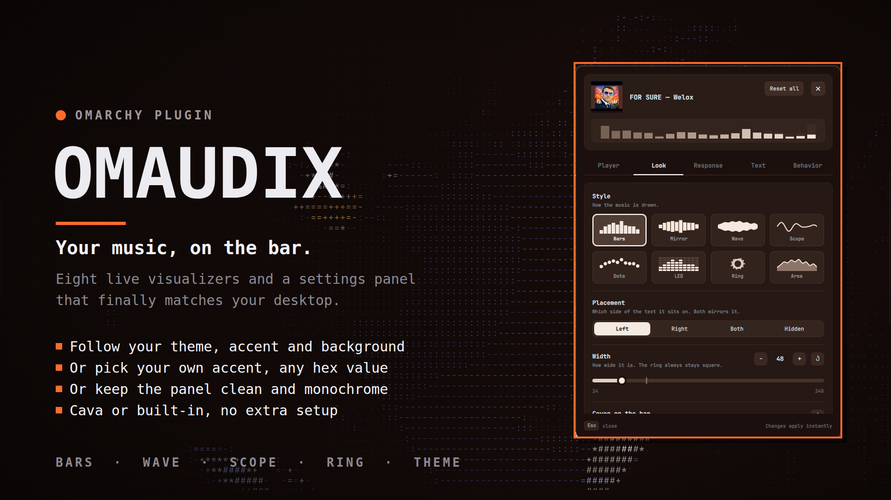
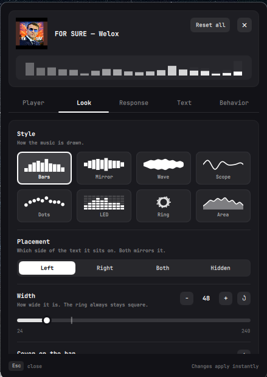
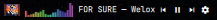

# Omaudix

A now-playing widget for the Omarchy bar: live visualizer, fixed-width scrolling
`artist - title`, and playback controls for any MPRIS player (Spotify, browsers, ...).





## Features

- **8 visualizer styles**: `bars`, `mirror`, `wave` (smooth blob), `scope` (real
  oscilloscope), `dots`, `led` (segmented meter), `ring` (radial), `area` (filled mountain).
- **4 color modes**: follow the bar theme, fade, rainbow, or your own hex color.
- **Settings panel colors**: the settings panel itself can `theme` (bring your Omarchy theme's
  accent and background into the panel), use a `custom` accent hex, or stay `monochrome` (neutral grey).
  Text always follows the bar foreground. If the shell exposes no theme accent, `theme` looks like `monochrome`.
- **Position**: visualizer on the `left`, `right`, `both` sides (mirrored) or `hidden`.
  Controls can sit on either end too.
- **Capped-width text**: titles that fit are shown at their own width (buttons sit right next to
  them; turn off `compactText` for a fixed width). Text that does not fit scrolls `left`, `right`, `bounce`s, or is truncated (`off`). Speed and the
  rest time before each scroll are adjustable. Text that fits can be left/center/right aligned.
- **Text format**: `artist - title`, `title - artist`, title only, artist only, custom separator.
- **Spectrum engine**: uses `cava` if installed, otherwise a built-in FFT (about 3% of one
  core at 30 fps). The scope style always uses its own capture.
- **Tuning**: sensitivity, smoothing, frame rate, band count.
- **Interactions**: left click (play/pause, next, or nothing), middle click next, mouse
  wheel skips tracks *or* cycles the visualizer style live.
- **Player switcher**: the settings panel lists every MPRIS player (Spotify, YouTube Music in a
  browser, cliamp, radio apps...) with what each is playing. Picking one pauses the others and plays it; keep
  `Auto` to just follow whatever is playing. Players that all call themselves "mpv" (or a browser)
  are told apart from their track URL / cover art (YouTube Music, Spotify, Radio, Local file...);
  `omarchy-shell io.github.qempexe.omaudix status` shows each player's `url` if one is not recognised.
- **Cover on the bar** (optional): the song's cover, or a note icon when there is none, placed
  `left` (before everything), `center` (right before the text) or `right` (after everything).
- **Follows external changes**: when another player starts playing, Omaudix switches to it. Turn on
  `pauseOthers` to also pause whichever player was playing before (off by default).
- Horizontal and vertical bars, multi-monitor safe (one shared audio helper).
- The audio helper only runs while something is playing and the visualizer is visible.





... and many, many more combinations!

## Requirements

- [Omarchy](https://omarchy.org) with its Quickshell-based bar
- PipeWire (`pw-record`) and Python 3, used by the built-in spectrum engine and the scope
- Optional: [cava](https://github.com/karlstav/cava) for its spectrum engine (install it with your package manager)

## Install

Directly from the repo (no scripts):

```
omarchy plugin add https://github.com/qempexe/omarchy-omaudix.git --enable
```

Or manually, from a local copy of this folder:

```
mkdir -p ~/.config/omarchy/plugins/io.github.qempexe.omaudix
cp -r ./. ~/.config/omarchy/plugins/io.github.qempexe.omaudix/
omarchy plugin validate ~/.config/omarchy/plugins/io.github.qempexe.omaudix
omarchy plugin enable io.github.qempexe.omaudix --section left     # or center / right
```

The widget is always visible once placed. With nothing playing it shows an idle
"Nothing playing" label; enable **Hide when paused** if you want it gone instead.
You can also move it with
`omarchy bar move io.github.qempexe.omaudix --section left`.

Remove: `omarchy plugin remove io.github.qempexe.omaudix`.

Optional: install cava for its spectrum. Without it the built-in engine is used.

## Settings

All of these appear in Omarchy's widget settings UI.

| Setting | Values | Default |
| --- | --- | --- |
| `vizStyle` | bars, mirror, wave, scope, dots, led, ring, area | bars |
| `vizSide` | left, right, both, hidden | left |
| `vizWidth` | 24-240 px | 72 |
| `barCount` | 6-64 | 20 |
| `colorMode` | theme, fade, rainbow, custom | theme |
| `customColor` | hex like `#7aa2f7` | #7aa2f7 |
| `panelColor` | theme, custom, monochrome (colors of the settings panel) | theme |
| `panelCustomColor` | hex like `#7aa2f7` (used when `panelColor` is custom) | #7aa2f7 |
| `sensitivity` | 25-400 % | 100 |
| `smoothing` | 0-100 | 60 |
| `fps` | 15-60 | 30 |
| `engine` | auto, cava, builtin | auto |
| `player` | auto or a D-Bus name (pick it in the panel) | auto |
| `showText` | true / false | true |
| `textFormat` | artist-title, title-artist, title, artist | artist-title |
| `separator` | any text | ` - ` |
| `compactText` | true / false | true |
| `textWidth` | 60-400 px (maximum) | 160 |
| `scrollDirection` | left, right, bounce, off | left |
| `scrollSpeed` | 10-120 px/s | 35 |
| `scrollPause` | 0-5000 ms | 1500 |
| `textAlign` | left, center, right | left |
| `showControls` | true / false | true |
| `controlsSide` | left, right | right |
| `hideWhenPaused` | true / false | false |
| `pauseOthers` | true / false | false |
| `coverSide` | hidden, left, center, right | hidden |
| `coverSize` | 10-36 px | 16 |
| `clickAction` | playPause, next, none | playPause |
| `wheelAction` | track, style, none | track |
| `showAlbumArt` | true / false (cover in the settings panel header) | true |

Inline form in `~/.config/omarchy/shell.json`:

```json
{ "id": "io.github.qempexe.omaudix", "vizStyle": "ring", "vizSide": "both", "scrollDirection": "bounce" }
```

## Shell commands

```
omarchy-shell io.github.qempexe.omaudix status       # JSON: media, helper state, last error
omarchy-shell io.github.qempexe.omaudix cycleStyle   # next visualizer style (until shell restart)
omarchy-shell io.github.qempexe.omaudix resetStyle
omarchy-shell io.github.qempexe.omaudix restart      # restart the audio helper
omarchy-shell io.github.qempexe.omaudix playPause | next | previous
```

## How it works

```
Service.qml  -- reads the active MPRIS player (Quickshell.Services.Mpris), owns ONE helper process
  viz.py     -- cava (or built-in FFT over pw-record) / oscilloscope -> one text frame per line
BarWidget.qml -- layout, settings, clicks; Controls.qml, Visualizer.qml, MarqueeText.qml
SettingsPopup.qml / SettingRow.qml / SettingsStore.qml -- the settings panel and its saved overrides
```

The visualizer reacts to your **system output** (default sink monitor), not to one specific
player stream, and runs only while the selected player is playing. If a game or a second
app is making sound at the same time, it will show up in the visualizer as well.

## Tests

```
python3 tests/test_viz.py        # helper: FFT bands, scope, pacing, fake pw-record end to end
python3 tests/test_manifest.py   # manifest vs. QML settings drift
```


## Credits and thanks

- Inspired by **WaveBar**, the idea of a now-playing bar widget with a live visualizer.
- Thanks to the **Omarchy** project for the shell and plugin system this runs on.
- Thanks to **Quickshell** and **Qt** for the toolkit the widget is built with.
- Thanks to **PipeWire** for the audio capture, and to **cava** for its spectrum engine.
- Thanks to that banger song :)
- Thanks to everyone who tests it and reports issues.

## Disclaimer

Omaudix is an independent project. It is not affiliated with or endorsed by Omarchy,
WaveBar, Spotify, YouTube Music or any other service or player mentioned here; those names
are used only to describe what the widget can follow. Cover art is shown from the address
the player provides and is never stored or redistributed.

## License

MIT
